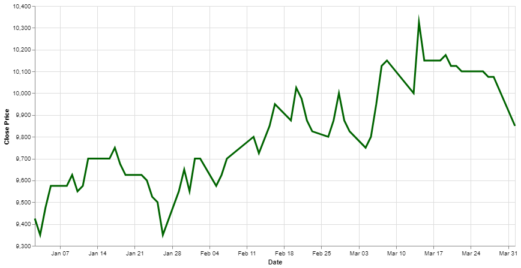
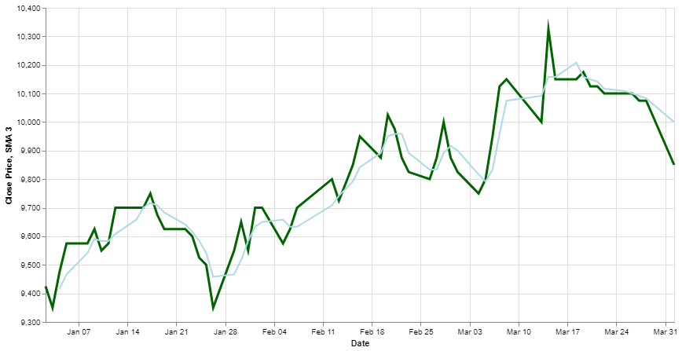

# Simple Moving Average on IDX Stocks
To analyze a company's stock price data, time series analysis on daily stock data is essential. [Sectors](www.sectors.app) provides this daily stock data, enabling you to conduct such an analysis. One common method used in time series analysis is the Simple Moving Average (SMA). The SMA is a calculation that takes the arithmetic mean of a given set of prices over the specific number of days in the past; for example, over the previous 15, 30, 100, or 200 days. By using [Sectors](www.sectors.app), you can effectively build your time series analysis using daily stock data.

## Install Required Libraries
- Install the [requests](https://requests.readthedocs.io/en/latest/) library to make HTTP Requests
- Install [pandas](https://pypi.org/project/pandas/) to do some data exploratory
- In this recipe we will use [altair](https://pypi.org/project/matplotlib/) to do the data visualization, if you are unfamiliar with altair, try to watch this playlist [Altair Tutorial](https://youtube.com/playlist?list=PLXsFtK46HZxXBddVC0FqmbGdlvbDbaqzx&si=cWtD0cFtwKg0b75v)
- This is not a library, but you will need your [Sector API Keys](https://www.subsectors.app/api) for this recipe

## Data Exploration
In this recipe, we will use the **Daily Transaction Data API** from Sectors. Lets get the Daily Data of BBCA from January 2024 to March 2024.

```python
import requests
import altair as alt
import pandas as pd

API_KEYS = "Your API Keys"

headers = {
    "Authorization": API_KEYS
}
response = requests.get("https://sectors-api.fly.dev/api/data/daily/BBCA/?start=2024-01-01&end=2024-03-31", headers = headers)

if response.status_code == 200:
    daily_data = response.json()
else:
	# Handle error
	print("Error Status :",response.status_code)
```

If you try to print the `daily_data` it should look like the following

```
[{'symbol': 'BBCA.JK',
  'date': '2024-01-02',
  'close': 9425,
  'volume': 30545200,
  'market_cap': 1161866902503424},
 {'symbol': 'BBCA.JK',
  'date': '2024-01-03',
  'close': 9350,
  'volume': 34603300,
  'market_cap': 1152621314310144},
  ...,
 {'symbol': 'BBCA.JK',
  'date': '2024-01-04',
  'close': 9475,
  'volume': 56501800,
  'market_cap': 1168030583226368},]
```

As you can see, there are 5 properties we can get from the daily data, there are
- Symbol, the symbol that represent a company
- Date, the date of transaction
- Close, the closing price of that day
- Volume, transaction volume of that day
- Market Cap, the market cap of that day

Now using the closing price and date we can visualize it into a time series visualization.

## Data Visualization
Before visualize the data, lets transform the data to Pandas DataFrame.

```python
df = pd.DataFrame(daily_data, columns=["symbol","date","close","volume","market_cap"])
```

### Time Series Visualization
Now lets visualize the closing price data using altair

```python
chart = alt.Chart(df).mark_line(size=3).encode(
    x=alt.X('date:T', axis=alt.Axis(title='Date')),
    y=alt.Y('close:Q', axis=alt.Axis(title='Close Price'), scale=alt.Scale(zero=False)),
    tooltip=['date:T', 'close:Q'],
    color=alt.value('darkgreen')
).properties(
    width=800,
    height=400
)

chart.display()
```


Now we see the time series visualization on BBCA daily transaction data from January 2024 to March 2024.

### Simple Moving Average(SMA)

Its good if you already familiar with SMA method for time series analysis, but no worries if you haven't, take a look at this [SMA Article](https://www.fidelity.com/learning-center/trading-investing/technical-analysis/technical-indicator-guide/sma#:~:text=SMA%20is%20the%20easiest%20moving,used%20to%20determine%20trend%20direction.). Lets use 3-Day SMA to the chart

```python
df['sma_3'] = round(df.iloc[:,2].rolling(window=3).mean(),2)

chart = alt.Chart(df)

close_price = chart.mark_line(size=3).encode(
    x=alt.X('date:T', axis=alt.Axis(title='Date')),
    y=alt.Y('close:Q', axis=alt.Axis(title='Close Price'), scale=alt.Scale(zero=False)),
    tooltip=['date:T', 'close:Q'],
    color=alt.value('darkgreen')
).properties(
    width=800,
    height=400
    )

sma_3 = chart.mark_line().encode(
    x=alt.X('date:T', axis=alt.Axis(title='Date')),
    y=alt.Y('sma_3:Q', axis=alt.Axis(title='SMA 3')),
    tooltip=['date:T', 'sma_3:Q'],
    color=alt.value('lightblue')
)

close_price + sma_3
```


We've successfully incorporated a 3-day Simple Moving Average (SMA) into our chart, demonstrating the flexibility of our visualization tools. The Sectors API simplifies the process of obtaining IDX Stocks data, providing daily transaction data that can be used to create a wide variety of visualizations. With this data, you can track trends, compare performance, and analyze market movements, tailoring your visualizations to meet your specific needs and objectives.